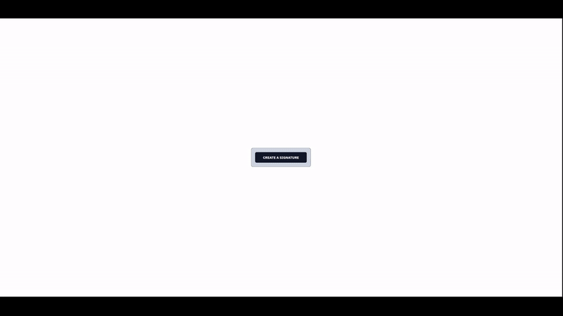

# Signatures
Get a signature from a signature draw pad or from a selection of 4 cursive font inputs.
Outputs the result as a **base64 encoded** string.

### Draw Pad


### Input


## Tech
- react
- typescript
- tailwind
- vite
- shadcn
- react-signature-pad-wrapper
- vitest

## How to use


### 1. Use the entire prebuilt dialog
- `src/lib/signature-dialog.tsx`
This component wants two mandatory props:
- `child` that will serve as a dialog trigger.
- `setImage` function to consume the output base64 encoded data.

Example found in `src/component-demo.tsx`.

```
<SignatureDialog colors={colors} setImage={setBase64Image}>
    <Button>
      CREATE A SIGNATURE
    </Button>
  </SignatureDialog>
```
- you can optionally pass an array of colors, defaults to black only if the prop has been omitted.
---
### 2. Use the `draw` pad and `type` pad components individually
### DRAW
- the `draw` component can be found in `src/lib/signature/draw.tsx`
- takes the following props:
  - **mandatory** `ref` a forwarded ref to expose the underlying canvas' data
    - data can be exported as one of `image/jpeg` | `image/png` | `image/svg+xml`
  - `colors`
  - `initialColor` if you want to preselect a color of your choice. Must be one of the values of the `colors` array.
  - `outputFormat` one of `image/jpeg` | `image/png` | `image/svg+xml`
  - `setValid` a function to control the parent's whatever (i.e. disable a submit)
---
### TYPE
- the `type` component can be found in `src/lib/signature/type.tsx`
- exports the signature with one of the 4 hardcoded fontStyles: `caveat`, `pacifico`, `marckScript` and `meddon`
- takes the following props:
  - **mandatory** `ref` a forwarded ref to expose base64 encoder
  - `colors`
  - `initialColor` if you want to preselect a color of your choice. Must be one of the values of the `colors`
  - `setValid` a function to control the parent's whatever (i.e. disable a submit)

- this approach allows us to compose the UI differently than what the `signature-dialog.tsx` demos.
